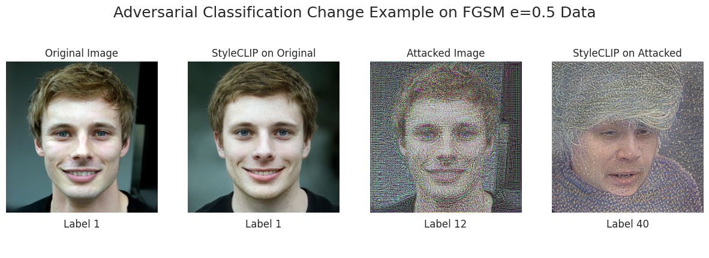
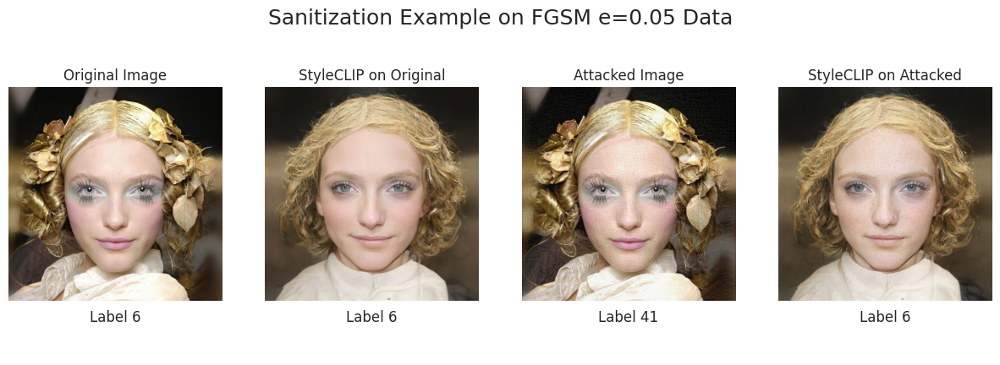
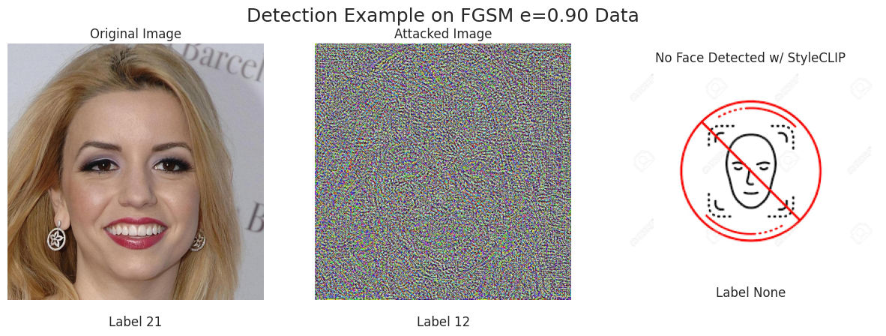

# StyleCLIP as a Defense Tool Against Deep Learning Facial Recognition Attacks

### Developers
* Carter Gilbert (cartergilbert@vt.edu)
* Daniel Hassler (hassledw@vt.edu)


## Introduction
Deep learning adversarial attacks such as FGSM (fast gradient sign method), a white-box approach aimed to misclassify images on image classifiers, can do serious damage to the trustworthiness of deep learning classification models. Our goal is to defend against such attacks using StyleCLIP as an image denoising/detection tool.

Here is an example of our defense at work:



## StyleCLIP_Defense Main File Contents
* **attackstorch.py**: this is our attack method file, callable for several different torch attack methods.
* **celeb_classifier.py**: contains the method that passes data through for classification.
* **celeb_metrics.ipynb**: code containing all metrics of our attacks and defense.
* **celeb_train.py**: code to train the CelebAHQ classifier.
* **defense.py**: our StyleCLIP defense implementation, adapted from StyleCLIP's source code. Note: in our environment, we stored this file under `StyleCLIP` and created a symlink to it in our repo due to pathing issues we encountered.
* **CelebA_HQ-Labeled**: a folder containing all of our test, attack, and defense classifications in CSV files.
  
## Dataset
Since StyleCLIP is limited to face data, we are running all of our evaluations on the [CelebA_HQ](https://github.com/ndb796/CelebA-HQ-Face-Identity-and-Attributes-Recognition-PyTorch) dataset. This dataset is specifically used for facial recognition; classifier details are in the CelebA_HQ github link.

## Setup

### Environment Setup
Here are some notes about our environment. We did all of our development on a linux platform with access to Tesla T4 GPUs, and our directory structure looks like this:
```
.
├── bin
├── encoder4editing
├── ninja-linux.zip
├── StyleCLIP
    ├── cog_predict.py
    ├── cog.yaml
    ├── criteria
    ├── defense.py
    ├── global_directions
    ├── global_torch
    ├── img
    ├── LICENSE
    ├── licenses
    ├── mapper
    ├── models
    ├── notebooks
    ├── optimization
    ├── pretrained_models
    ├── __pycache__
    ├── README.md
    ├── results
    └── utils.py
├── StyleCLIP_Defense
    ├── attackstorch.py
    ├── CelebA_HQ_facial_identity_dataset
    ├── CelebA_HQ-Labeled
    ├── celeb_classifier.py
    ├── celeb_metrics.ipynb
    ├── celeb_train.py
    ├── defense.py
    ├── FaceRecog_Adv.py
    ├── facial_identity_classification_transfer_learning_with_ResNet18.pth
    ├── FFHQ-Sentiment-Files
    ├── figures
    ├── README.md
    └── resources
```
### Setup StyleCLIP
To get StyleCLIP successfully working, navigate to the [StyleCLIP repo](https://github.com/orpatashnik/StyleCLIP) and follow the setup instructions. The final result of this setup should resemble our pathing structure listed above.
```
git clone git@github.com:orpatashnik/StyleCLIP.git
```
### Clone Repo
Next, clone our repo according to the tree structure above. This should be in the same parent directory as StyleCLIP.
```
git clone git@github.com:hassledw/StyleCLIP_Defense.git
```
### Source Code Environment Download
Alternatively, if StyleCLIP setup is causing problems, we have our own instance linked to this google drive link:
```
https://drive.google.com/file/d/1PlnKXhi--SjtLdXxR8gWlaI5tF5qpDhK/view?usp=sharing
```
The ZIP folder in the source code environment download, titled "Source-Env-StyleCLIP_Defense.zip" contains our specific instance of StyleCLIP and encoder4editing, the specific envrionment instances we tweaked for our defense implementation. The only changes we made to StyleCLIP were path modifications. For our defense implementation in `defense.py`, please change the absolute path to the correct path on your machine.

## Instructions
Our main driver file used to classify, run attacks, and generate defense images is `FaceRecog_Adv.py`. To run our full-stack framework, run this on a CUDA enabled GPU:
```
python3 FaceRecog_Adv.py
```
If you would like to modify this result, navigate to the `main()` method. Here is an example of running four different FGSM attacks and running the defense sequentially:
```
    model = load_model()
    model.to(device)
    defense = Defense()

    labels_test = classify("test", model)

    # runs attack
    attacknames = ["FGSM05", "FGSM10", "FGSM25", "FGSM50"]
    attacks = [FGSM(model, eps=0.05), FGSM(model, eps=0.10), FGSM(model, eps=0.25), FGSM(model, eps=0.50)]
    for attackname, attack in zip(attacknames, attacks):
        attack_celeb(attack, labels_test, attackname)
        _ = classify(attackname, model)
        defend_celeb(attackname, defense)
        _ = classify(f"StyleCLIP-{attackname}", model)
```
The output of the attacked and generated defended images should be placed in a folder called `CelebA_HQ_facial_identity_dataset` with the respective name. An attacked foldername should be of naming convention `AttackXX` and the defense folder name should be of naming convention `StyleCLIP-AttackXX`.

## More Examples of our Defense


